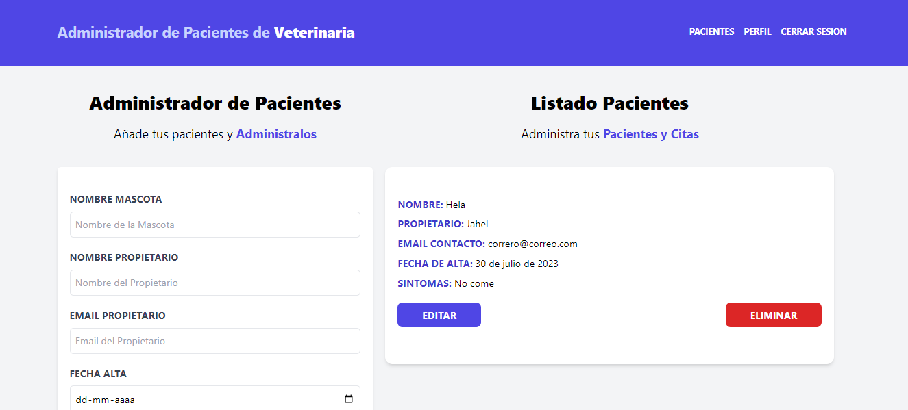
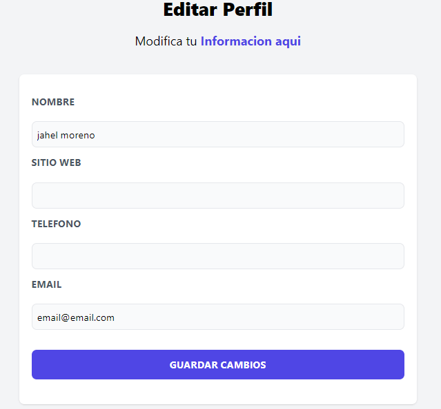
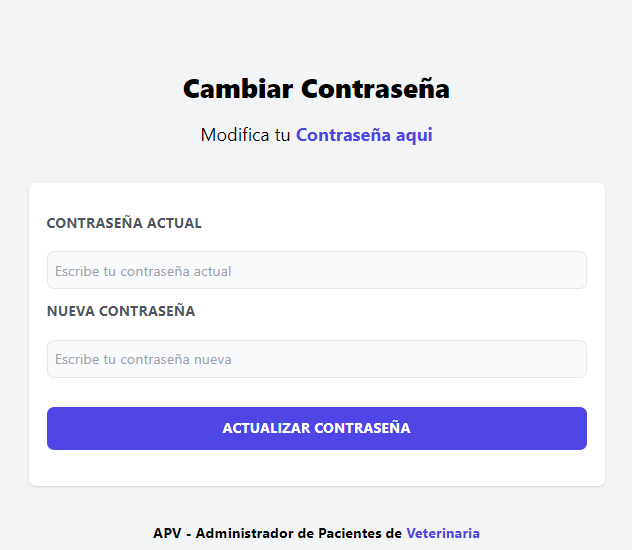

<h1>MERN - APV - Administrador Pacientes Veterianaria  🐕‍🦺🐶🧑‍⚕️</h1>

## Descripción 
Este proyecto es un backend desarrollado utilizando MongoDB y Mongoose para establecer una conexión segura y eficiente con la base de datos. Se han implementado características esenciales como la validación de usuarios, el hash de contraseñas utilizando bcrypt y el uso de JWT para la confirmación por correo electrónico. Además, se ha agregado la funcionalidad de restablecimiento de contraseñas en caso de olvido. El backend ha sido rigurosamente probado utilizando Postman para asegurar un funcionamiento óptimo.
Para el envío de correos, actualmente se utiliza Mailtrap para simular el envío, pero estoy trabajando en la integración con el envío real. También implementé CORS para permitir el acceso controlado desde diferentes dominios. Además, utilicé dotenv para gestionar las variables de entorno de forma segura.
## Características
- Backend completado exitosamente utilizando MongoDB con Mongoose para establecer una conexión segura y eficiente.
- Implementación de validación de usuarios y hash de contraseñas con bcrypt para una mayor seguridad.
- Uso de JWT para la confirmación por correo electrónico y restablecimiento de contraseñas en caso de olvido.
- Pruebas exhaustivas realizadas utilizando Postman para garantizar un funcionamiento correcto.

## Tecnologías Utilizadas
- MongoDB
- Mongoose
- bcrypt
- JWT
- Postman
- Mailtrap
- CORS
- dotenv

## Autor ✒️
**Yechua Silva**

* [LinkedIn](https://www.linkedin.com/in/yechua-silva/)

## Ver ejemplo en vivo 
Ejemplo en vivo FullStack
- [https://mern-apv-yechua-silva.netlify.app/](https://mern-apv-yechua-silva.netlify.app/)

## Configuración

1. Clona el repositorio: `git clone https://github.com/yechua-silva/MERN-apv-backend.git`
2. Instala las dependencias: `npm install`
3. Configura las variables de entorno en el archivo `.env`.
4. Inicia el servidor: `npm start`  o con nodemon `npm run dev`
  
## Contratación
Si estás interesado en contratarme, puedes ponerte en contacto conmigo escribiendo a yechua-silva@outlook.cl para cualquier consulta o solicitud.
